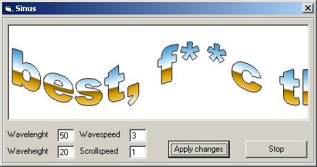



## SinusScroll

### Description

This recreates (in a way) those sinusscroll effects that were very commonly seen in the old demo days on the amiga. I find it hard to see any use of this code but it might be fun for someone. Plz comment!!!
 
### More Info
 

             |
---                |---
**Submitted On**   |2002-09-03 07:11:04
**By**             |[Persona non grata](https://github.com/Planet-Source-Code/PSCIndex/blob/master/ByAuthor/persona-non-grata.md)
**Level**          |Intermediate
**User Rating**    |4.3 (26 globes from 6 users)
**Compatibility**  |VB 4\.0 \(32\-bit\), VB 5\.0, VB 6\.0
**Category**       |[Graphics](https://github.com/Planet-Source-Code/PSCIndex/blob/master/ByCategory/graphics__1-46.md)
**World**          |[Visual Basic](https://github.com/Planet-Source-Code/PSCIndex/blob/master/ByWorld/visual-basic.md)
**Archive File**   |[SinusScrol125962932002\.zip](https://github.com/Planet-Source-Code/persona-non-grata-sinusscroll__1-38616/archive/master.zip)

